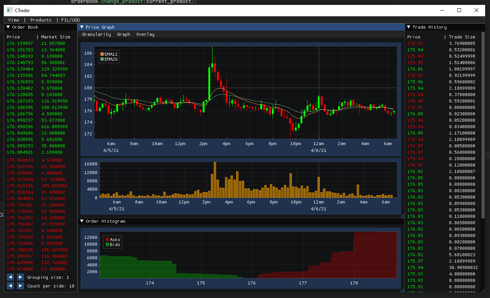

# CTrader

<div align="center">
    
</div>

CTrader is a personal project, Coinbase Pro trading app, that resulted from the fact that coinbase pro's web interface 
uses a massive amount of CPU resources. I thought I would try my hand at creating a feature
parity application. 

*It is not finished, so any help is appreciated.*

## TODO

* Order Window/System
    * It must keep track of placed orders, using either websocket or REST API
* Add testing for Websocket class in libCTrader
* Scale inner windows to outer window's size changes.

## Building
This project using the CMake build system as well as the CPM CMake dependency manager. 
The minimum required CMake version is 3.17.
### Linux 
A couple dependencies on linux,
* Cpprestsdk - https://github.com/microsoft/cpprestsdk
* OpenSSL
* Boost - Minimum version required is 1.75.0 w/ boost-signals2
The rest of the dependencies will be downloaded automatically,
  via CPM during the build processes.
```
git clone --recursive https://github.com/anhydrous99/CTrader
cd CTrader 
mkdir build
cd build
cmake ..
make
```
### MacOS
The required dependencies listed above can be installed via brew then the same build process can be used. XCode is required. 
It has been tested on an Mac with an M1 chip.

### Windows
Installing on windows is a bit more hands on. Visual Studio or Build Tool for Visual studio, w/ the C++ compiler, must be install. I tend to use vcpkg to get the required dependencies, https://github.com/microsoft/vcpkg.
A possible build process would be
```
git clone --recursive https://github.com/microsoft/vcpkg
cd vcpkg
bootstrap-vcpkg.bat
vcpkg.exe install boost:x64-windows boost-signals2:x64-windows cpprestsdk[websockets]:x64-windows curl:x64-windows openssl-windows:x64-windows
```
vcpkg should build and install the dependencies within the vpckg/installed/x64-windows directory. You can then strap vcpkg to CMake with the cmake script at `vcpkg/buildsystems/vcpkg.cmake`.
```
git clone --recursive https://github.com/anhydrous99/CTrader
cd CTrader
mkdir build
cd build
cmake -DCMAKE_TOOLCHAIN_FILE=<path to vcpkg>\vcpkg\scripts\buildsystems\vcpkg.cmake ..
cmake --build . --target CTrader
```